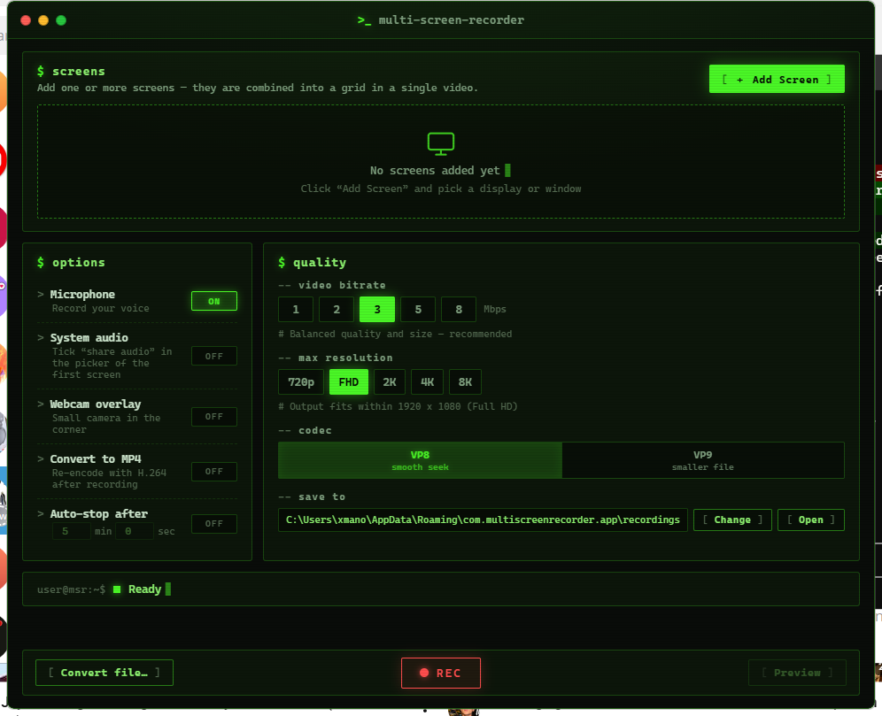

<div align="center">

# 🖥️ Multi Screen Recorder

**Record multiple screens at once — combined into a single video.**

A fast, lightweight desktop screen recorder for Windows, built with Tauri 2 (Rust + WebView2).
Terminal-style UI. No accounts, no telemetry, no watermarks. Free & open source.

[](https://tauri.app)
[](https://www.rust-lang.org)
[](https://github.com)
[](LICENSE)



</div>

---

## ✨ Why Multi Screen Recorder?

Most screen recorders capture **one** display at a time. If you work with multiple monitors — trading dashboards, live ops monitoring, multi-window demos, game + chat layouts — you normally need OBS and a pile of configuration.

**Multi Screen Recorder does it in two clicks**: add up to 4 screens or windows, hit `REC`, and get a single video with everything laid out in a clean grid.

## 🚀 Features

| | Feature | Details |
|---|---|---|
| 🖥️ | **Multi-screen capture** | Up to 4 screens/windows in one video — auto grid layout (2 → side by side, 3–4 → 2×2) |
| 👀 | **Live previews** | See every source live before and during recording |
| 📐 | **Standard output sizes** | Cap output at 720p / Full HD / 2K / 4K / 8K — scaled down cleanly, never stretched |
| 🎙️ | **Microphone** | Mixed into the recording in real time |
| 🔊 | **System audio** | Capture what you hear (share-audio picker) |
| 📷 | **Webcam overlay** | Picture-in-picture in the corner |
| ⏱️ | **Auto-stop timer** | Set minutes/seconds, walk away — with live countdown |
| 🎚️ | **Quality control** | Bitrate 1–8 Mbps, VP8 (smooth seeking) or VP9 (smaller files) |
| 🎬 | **MP4 export** | One-click conversion to H.264 MP4 (faststart, seek-optimized) with progress bar |
| 🔁 | **File converter** | Convert existing WebM/MKV/AVI files to MP4 |
| 📁 | **Custom save folder** | Pick where recordings go — remembered between launches |
| 🖤 | **Terminal UI** | Phosphor-green, CRT-scanline, keyboard-culture aesthetic |

**Small footprint**: the app binary is ~10 MB (plus bundled FFmpeg). No Electron, no Chromium bundle — it uses the WebView2 runtime already on your Windows.

## 📦 Download & Install

1. Grab the latest **`Multi Screen Recorder_x.x.x_x64-setup.exe`** from [**Releases**](../../releases/latest)
2. Run the installer (per-user, no admin required)
3. Launch, click `[ + Add Screen ]`, pick a display, hit `[ ● REC ]`

> **Requirements:** Windows 10/11 with [WebView2 Runtime](https://developer.microsoft.com/microsoft-edge/webview2/) (preinstalled on Windows 11 and most updated Windows 10 systems).

## 🎯 Quick start

1. **Add screens** — click `[ + Add Screen ]` for each display/window (tick *"share system audio"* on the first one if you want system sound)
2. **Tune options** — mic, webcam overlay, MP4 conversion, auto-stop timer
3. **Pick quality** — bitrate, codec, and max resolution (`720p`–`8K`)
4. **Record** — `[ ● REC ]` to start, `[ ■ STOP ]` to finish
5. Your video lands in the save folder — preview it in-app or convert to MP4

## 🛠️ Building from source

```bash
# Prerequisites: Rust (stable), Node.js 18+
git clone <this-repo>
cd multi-screen-recorder
npm install

# FFmpeg (bundled binary is not committed):
# drop a static ffmpeg.exe into src-tauri/binaries/
# e.g. from https://www.gyan.dev/ffmpeg/builds/ or npm's ffmpeg-static

npm run dev     # run in development
npm run build   # build the NSIS installer -> src-tauri/target/release/bundle/nsis/
```

## 🏗️ Architecture

```
src/                      # Frontend — vanilla HTML/CSS/JS, no bundler (withGlobalTauri)
  main.js                 #   getDisplayMedia capture, canvas grid compositor, MediaRecorder
src-tauri/
  src/main.rs             # Settings, save recordings (raw IPC), folder dialogs
  src/encoder.rs          # FFmpeg: MP4 encode with progress events, WebM PTS fix
  binaries/ffmpeg.exe     # Bundled FFmpeg (release resource, not in git)
```

**Recording pipeline:** `getDisplayMedia` per screen → canvas grid composition @60fps (scaled to the resolution cap) → `MediaRecorder` (WebM, 1s timeslice) → raw-IPC save → FFmpeg `+genpts` remux → optional H.264 MP4 encode.

## 📄 License

[MIT](LICENSE) — free for personal and commercial use.

---

<div align="center">
<sub>Built with 🦀 Rust + Tauri · UI inspired by the terminals we live in</sub>
</div>
